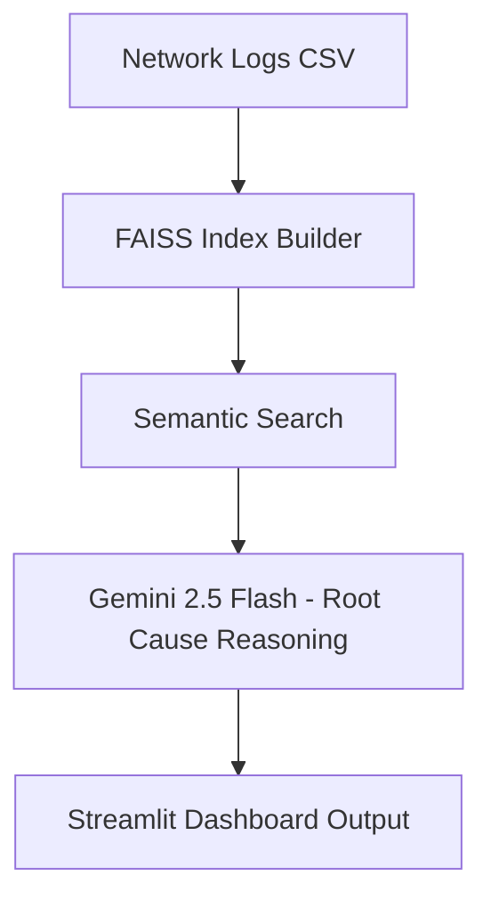

# Network Log Automation with RAG and LLMs

A compact prototype designed to explore how **retrieval-based AI pipelines** can support real-time network monitoring.  
Built around the idea of combining **semantic search** and **language model reasoning**, this project demonstrates the basic mechanisms behind intelligent automation systems.

---

## 1. Purpose and Context

This project was developed to **understand and implement the core components** of a retrieval-augmented generation (RAG) workflow — vector indexing, semantic retrieval, and LLM-based summarization — and to **strengthen these concepts through hands-on implementation**.

In modern network operations, AI-driven automation is becoming essential:  
logs are unstructured, high-frequency, and difficult to interpret manually.  
A RAG-based approach helps by connecting **relevant past incidents** to **current alerts**, providing faster insight and early fault detection.

The system here is intentionally lightweight — its goal is to show *how the pieces fit together*, not to be a full-scale product.

---

## 2. What It Does and Why It Matters

The app performs a simplified version of network automation and reasoning:

1. **Watches** a directory for new log files  
2. **Indexes** log messages using FAISS for semantic retrieval  
3. **Retrieves** relevant entries for a given query  
4. **Summarizes** likely root causes through an LLM (Gemini 2.5 Flash)  
5. **Displays** logs and evaluation metrics via Streamlit

Each step mirrors real-world automation logic:  
- monitoring → **data awareness**,  
- retrieval → **information grounding**,  
- summarization → **explainable reasoning**.  

Together, they form a reproducible workflow where an engineer can query complex logs in plain English and instantly see context-aware results.

---

## 3. Architecture Overview

```
📦 mikro-rag/
├── app.py                # Streamlit UI and pipeline integration
├── utils/
│   ├── retrieval.py      # FAISS index + semantic search logic
│   ├── llm.py            # Gemini 2.5 Flash API wrapper
│   └── __init__.py
├── auto_update.py        # watches data/ folder and updates index
├── evaluate.py           # evaluates retrieval metrics (precision@k, latency)
├── data/
│   ├── sample_logs.csv   # demo dataset
│   └── eval_results.csv  # generated during evaluation
├── requirements.txt
└── README.md
```

**Pipeline Flow**


---

## 4. Example Queries

You can use natural language queries such as:

| Query | Purpose |
|--------|----------|
| `packet loss in node 1` | Finds similar log messages related to packet loss events. |
| `cpu usage high` | Retrieves logs about CPU utilization spikes. |
| `link down alert` | Lists network failure logs with similar context. |
| `power issue node 5` | Identifies recurring power-related alerts. |

These examples simulate how a real engineer might use the tool to quickly correlate issues and hypothesize causes.

---

## 5. Setup and Run

**Local Setup (Windows / macOS / Linux)**
```bash
git clone https://github.com/asmarufoglu/mikro-rag.git
cd mikro-rag
python -m venv venv
# Windows:
venv\Scripts\activate
# macOS/Linux:
source venv/bin/activate
pip install -r requirements.txt
streamlit run app.py
```

**Environment Configuration**
```ini
GOOGLE_API_KEY=your-key-here
```

**Optional: Docker Run**
```bash
docker build -t network-rag .
docker run -p 8501:8501 network-rag
```
