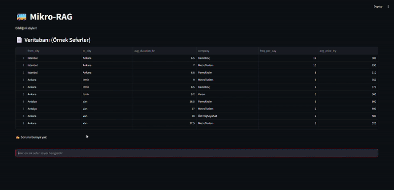

# Mikro-RAG-Personal Experiment 🎒🚌

This is a small, beginner-level prototype of a Retrieval-Augmented Generation (RAG)-style travel assistant built in Python using Gemini 1.5 Flash and Streamlit.

> ⚠️ This project is not for commercial use. It was built only for learning and showcasing key skills in RAG-like querying, prompt design, and basic data filtering.

---

## 🔍 What It Does

You can ask travel-related questions like:

- "Which trips take more than 10 hours?"
- "En ucuz İstanbul'dan Ankara'ya giden sefer?"
- "Van'a en sık sefer yapan firma?"

The app will:
1. Parse your question
2. Filter the trip data (from a live Google Sheet)
3. Ask Gemini for a short summary response
4. Show a clean table with matching results

---

## 🚀 Tech Stack
- Python
- Pandas
- Streamlit
- Google Gemini API (1.5 Flash)
- Regex-based NLP
- Google Sheets (live data)

## 🧠 What This Project Shows
This simple prototype was built to explore how user questions can guide data filtering and summarization using LLMs. It demonstrates:

- Natural language → structured query parsing (via regex)

- Basic RAG-style logic with Gemini for context-aware answers

- API key usage & secure .env config

- Live integration between Google Sheets and pandas

- Lightweight UI with Streamlit

🎯 Just a personal experiment — not commercial — to show how small AI workflows can be built around real data and real questions.

---

## 🖼 Demo



---

## ⚙️ How to Run

1. Clone the repo:
   ```bash
   git clone https://github.com/your-username/mikro-rag.git
   cd mikro-rag

2. Create a virtual environment:

    ```bash
    python -m venv venv
    source venv/bin/activate  # on Windows: venv\Scripts\activate

3. Install requirements:
    ```bash
    pip install -r requirements.txt


4. Add your .env file:
    ```ini
    GEMINI_API_KEY=your-key-here

5. Run the app:
    ```bash
    streamlit run main_app.py

    or
    
    python -m streamlit run main_app.py


## 📁 File Structure
    ├── main_app.py
    ├── utils/
    │   ├── parsing.py
    │   ├── filtering.py
    │   └── llm.py
    ├── .env
    ├── requirements.txt
    ├── README.md
    └── demo.gif  

## 🙋 Why This Project?
This is a personal learning exercise, not a production-level app. I wanted to better understand how to:
- connect LLMs to structured data
- build prompt-response pipelines
- create something small but functional to show in interviews


# Thanks for checking it out! 🌱 
Got suggestions or feedback? I'm all ears. Feel free to fork or build on this if it inspires you. 